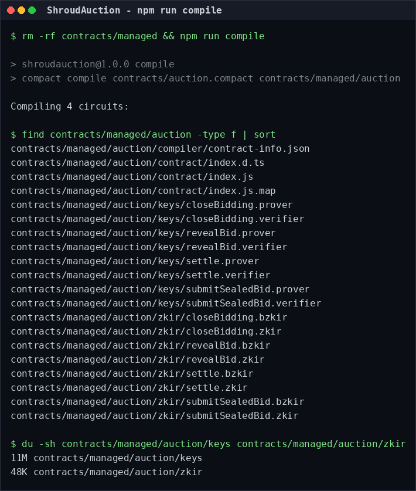
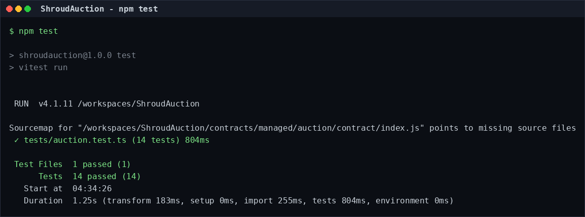
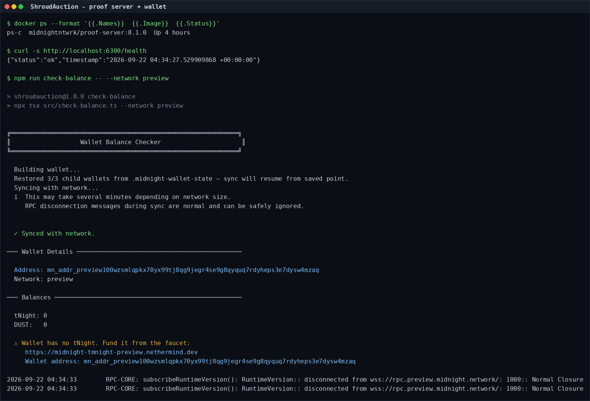

# ShroudAuction

> A sealed-bid auction on Midnight where bids stay secret while bidding is open, and losing bid amounts are never revealed — not even to the auctioneer.

## Live Demo

**<https://frontend-liart-nine-0xq4nwn1c5.vercel.app>**

Deployed on Vercel (project `frontend`) and built on Node 22. The site is fully static from the same origin: the compiled contract module is bundled, and the proving keys and zkir are served from `/contracts/auction/{keys,zkir}` as `application/octet-stream`. It targets Midnight **Preprod** and talks to the contract address below.

> Requires the [Lace wallet](https://www.lace.io/) extension, switched to Preprod. Source repository: <https://github.com/Richardkingz2019/ShroudAuction>. The deploy steps are in [Deploy the frontend](#deploy-the-frontend).

### Deployment Details

The current production deployment on Vercel:

| Detail           | Value                                                                          |
| ---------------- | ------------------------------------------------------------------------------ |
| Platform         | Vercel — fully static; no app server and no proof server on the host           |
| Project / scope  | `frontend` under `richardkingz2019`                                            |
| Live alias       | <https://frontend-liart-nine-0xq4nwn1c5.vercel.app>                            |
| Deployment URL   | <https://frontend-o6pnzr9zd-richardkingz2019.vercel.app>                       |
| Deployment id    | `dpl_8D4n94wda7wssEDbVqRCtDHgDPrL`                                            |
| Deployed         | 2026-09-22 10:54 UTC                                                           |
| Root directory   | `frontend`                                                                     |
| Build            | `npm run build` (sync → `tsc --noEmit` → `vite build`) on Node 22.x, ~27s       |
| Build env        | `VITE_NETWORK_ID=preprod`, `VITE_CONTRACT_ADDRESS=mn_addr_preprod1yms6…ytv`     |

The deployment is a static bundle: Vite inlines the compiled contract module, and the proving keys and zkir under `/contracts/auction/` are served from the same origin. Redeploy from a checkout with:

```bash
cd frontend
vercel deploy --prod --yes \
  --build-env VITE_NETWORK_ID=preprod \
  --build-env VITE_CONTRACT_ADDRESS=<the 64-hex Preprod contract address>
```

`vercel deploy` (without `--prod`) produces a preview URL for testing before you promote it.

## Contract Address

| Network  | Address                                                                      |
| -------- | ---------------------------------------------------------------------------- |
| Preprod  | mn_addr_preprod1yms6jevlk8pvsgv9r4aphjdr283qf3v6yg8lt50vl3yzunn2zh9stxvytv   |
| Preview  | d3c3fc548fc3304c7ff9ab5019e3e35e051e3a26c71fc1dcc45968e89c3934d6             |

> **One thing to check before the demo.** A Midnight *deployed contract* is identified by a 64-hex contract address (like the Preview row above). The Preprod value is a Bech32m `mn_addr_preprod…` value, which is the shape of a wallet/account address rather than a contract address. If the frontend reports "no contract state" while pointed at Preprod, deploy there and drop in the hex address the deploy prints:
>
> ```bash
> npm run deploy -- --network preprod
> ```
>
> Then set `VITE_CONTRACT_ADDRESS` in `frontend/.env` (and in the Vercel project's env vars) to that hex address, and replace the Preprod row above.

### Fund This Wallet

The Preview contract above is deployed. It went out on 2026-09-22 from this wallet, which the faucet funded with 5,000,000,000 tNIGHT:

```
mn_addr_preview100wzsmlqpkx70yx99tj8qg9jegr4se9g8qyquq7rdyheps3e7dysw4mzaq
```

Funding is the one step of a deploy that has to happen in a browser: the faucet's public API is captcha-gated, so no script can drive it (see Notes). That matters again whenever the wallet changes — `npm run clean` discards it, and the next deploy creates a different wallet and address.

1. Open the network's faucet — <https://midnight-tmnight-preview.nethermind.dev> for Preview, <https://midnight-tmnight-preprod.nethermind.dev> for Preprod.
2. Paste the wallet address the deploy prints and request a drip.
3. Confirm it landed, then deploy:

   ```bash
   npm run check-balance -- --network preview   # tNight should be non-zero
   npm run deploy:preview
   ```

`deploy:preview` waits up to 10 minutes for the drip (`MIDNIGHT_FAUCET_TIMEOUT_MS` overrides it), registers the NIGHT for DUST, deploys, and rewrites the Preview row above from the recorded state — so the address is never retyped by hand.

The first sync of a wallet on a new network is the slow part of that, and it runs *before* the address is printed — which is awkward when the address is what you need in order to fund it. `--no-sync` skips the sync because the address derives from the seed rather than the chain:

```bash
npm run check-balance -- --network preprod --no-sync   # address in seconds
```

The Preprod deployer wallet is `mn_addr_preprod1yms6jevlk8pvsgv9r4aphjdr283qf3v6yg8lt50vl3yzunn2zh9stxvytv` — fund it at the Preprod faucet above before deploying there.

The address is safe to publish: it is a public address, not a key. The recovery phrase in the same gitignored file is the opposite — anyone holding it controls the funds.

## What This Does

ShroudAuction runs a sealed-bid (blind) auction in which the bids are hidden until the auctioneer closes bidding.

1. **Seal.** A bidder picks an amount and a 32-byte random nonce. The two are hashed together, and only the resulting 32-byte commitment is sent to the chain. The amount and nonce stay on the bidder's machine. Every bidder also picks a **pseudonym**, so a bid is not tied to a wallet address.
2. **Close.** The auctioneer closes bidding. No new commitments are accepted.
3. **Reveal.** Each bidder opens their commitment by proving, in zero knowledge, that their private amount and nonce hash to the commitment they published. The contract then compares the opened amount against the current highest bid.
4. **Settle.** Once every sealed bid has been opened, the auctioneer settles the auction and the leading bidder wins.

The interesting property is step 3. A bid that **does not** take the lead is verified and then discarded inside the proof: the amount is never written to the ledger. So the public chain reveals who bid (by pseudonym), that they bid, and which bid won — but not what any losing bidder offered. The auctioneer learns exactly as much as everyone else, which removes the usual sealed-bid problem of trusting the auctioneer to keep bids confidential.

**In the browser (Level 2).** `frontend/` is a React dApp that puts that flow in front of a user. Connecting Lace on Preprod hands the page a wallet-backed proving provider, so the bid is typed into a masked field, proved by the wallet, and submitted — while the page shows only the 32-byte commitment and the transaction id. The private amount is written to the browser's own private-state store and is never rendered, never logged, and never a field in the transaction. The app reads the public auction state straight from the indexer, which is the same listing the CLI prints.

## Privacy Model

**What is PUBLIC (on-chain, visible to anyone):**

| Ledger field    | Meaning                                                                 |
| --------------- | ----------------------------------------------------------------------- |
| `phase`         | `Bidding` / `Revealing` / `Settled`                                      |
| `auctioneer`    | The coin public key that created the auction                             |
| `bidCount`      | How many sealed bids were accepted (a `Counter`)                         |
| `sealedBids`    | Pseudonym → commitment. Shows *who* bid and the 32-byte hash, never the amount |
| `revealedCount` | How many bids have been opened                                           |
| `highestBid`    | The current winning amount, written only when a bid takes the lead       |
| `highestBidder` | The winning bidder's pseudonym                                           |

**What is PRIVATE (private witness, never on-chain):**

| Witness           | Meaning                                                              |
| ----------------- | -------------------------------------------------------------------- |
| `bidAmount()`     | The real bid, a `Uint<64>`                                            |
| `bidNonce()`      | 32 random bytes that blind the commitment so the amount can't be brute-forced out of the public hash |
| `bidderAlias()`   | The bidder's chosen pseudonym                                         |

These live in the bidder's private state and are handed only to the local proof server. They are never part of a transaction.

**What the bidder PROVES without revealing:**

> "The commitment I published really is the hash of a bid amount and a blinding nonce that I know."

The contract recomputes the commitment from the witnesses in-circuit and compares. If the amount were public, this check would be pointless — the whole point is that the comparison happens inside the proof.

**Where `disclose()` is used, and why.** The Compact compiler refuses to compile a ledger operation that could leak a witness value until it is wrapped in `disclose()`. Every one in this contract is deliberate, and there are only three:

1. `submitSealedBid` discloses the **pseudonym** (and the commitment hash, which the bidder already chose to publish) so the auction can enforce one sealed bid per pseudonym. A pseudonym carries no amount and is unlinkable to the bidder's wallet.
2. `revealBid` discloses the **comparison result** — one bit: "this bid took the lead". The alternative is worse: the resulting change to `highestBid` would leak that bit anyway, so disclosing it makes the leak explicit and intentional.
3. `revealBid` discloses the **amount**, but only for a bid that takes the lead. This is the only path by which an amount ever reaches the chain.

A losing bidder who never reveals leaks nothing at all. A losing bidder who does reveal leaks exactly one bit (they did not win) and nothing about their amount.

## Privacy Claim

**An on-chain observer of a sealed bid sees exactly three things: a pseudonym, a 32-byte commitment, and that a bid was accepted. There is no transaction field, receipt, log, event or indexed state anywhere on the chain that contains the bid amount — it exists only inside the zero-knowledge proof, on the bidder's machine and the wallet's proving provider.**

Stated as the two halves a reviewer can check:

- **A losing bidder's amount is never on-chain.** If the bid does not take the lead, the amount is verified inside the circuit and then discarded; the only ledger writes are the pseudonym's removal and a counter increment. The test suite asserts this by walking every bigint in the decoded ledger state and confirming the losing amount is absent (`tests/auction.test.ts`).
- **A winning bidder's amount is on-chain — by design.** The leading amount has to be published for the auction to settle. The privacy claim is about the *losing* bids, which is precisely the part a transparent ledger would otherwise leak.

The demo video walks this claim end to end: a bid is sealed (only the hash appears), the input never appears on screen, and the on-chain result shows the transaction without the amount.

## Tech Stack

- **Midnight network** — Preprod (target) and Preview testnets, plus a local devnet from Docker Compose
- **Compact** — the smart-contract language; toolchain 0.31.1, language version 0.23
- **Node.js v22** — required (`engines` enforces `>=22`)
- **Docker** — runs the local node, indexer and proof server
- **React 19 + Vite 7** — the browser dApp in `frontend/`
- **Lace wallet** — via `@midnight-ntwrk/dapp-connector-api` (v4); proofs delegate to the wallet's proving provider through `@midnight-ntwrk/midnight-js-dapp-connector-proof-provider`
- **Midnight.js SDK 4.1.1** — contract calls, indexer public data, browser private-state storage and ZK artifact fetching
- **TypeScript + tsx** — deploy/CLI scripts (root) and the frontend
- **Vitest** — unit tests against the compiled contract
- **Midnight.js 4.1.1 / wallet-sdk 1.2.0** — contract deployment and wallet plumbing (Node scripts)

## Prerequisites

- **Node.js v22** (`node --version` → `v22.x`). Node 24 is not what the SDK is tested against. A `.nvmrc` pins the major, so `nvm use` picks the right one up.
- **Docker** running, with Compose v2.
- **The Compact toolchain**, at the version this project was built against:

  ```bash
  # installs the `compact` devtools to ~/.local/bin
  curl --proto '=https' --tlsv1.2 -LsSf \
    https://github.com/midnightntwrk/compact/releases/download/compact-v0.5.2/compact-installer.sh | sh
  export PATH="$PATH:$HOME/.local/bin"

  compact update 0.31.1   # toolchain 0.31.1 → language 0.23, runtime 0.16.0
  ```

  The version matters: the generated code calls `checkRuntimeVersion('0.16.0')` and `package.json` pins `@midnight-ntwrk/compact-runtime` to `0.16.0`. Compiling with a newer toolchain (0.34.x targets ledger 9) produces artifacts that do not match the pinned runtime.

- On Windows the Compact compiler has no native binary, so `npm run compile` has to run inside WSL.

## Setup

```bash
git clone https://github.com/Richardkingz2019/ShroudAuction
cd ShroudAuction
npm install          # .npmrc sets legacy-peer-deps (see Notes)
npm run compile      # writes contracts/managed/auction/
```

Then start the devnet and deploy:

```bash
npm run setup                    # local devnet: node + indexer + proof server, then deploy
npm run setup -- --network preview   # or deploy to a public testnet
```

`npm run setup` brings up the Compose services, compiles, and deploys, in that order.

Against a public network the wallet is created on first use with a 24-word BIP-39 phrase (printed once and stored in `.midnight-state.json`, which is gitignored). The script prints the address and the faucet URL, then polls the balance every 10s and continues automatically once the funds land:

- Preview faucet: <https://midnight-tmnight-preview.nethermind.dev>
- Preprod faucet: <https://midnight-tmnight-preprod.nethermind.dev>

Once the deploy succeeds the address is recorded in `.midnight-state.json`, and the Preview row of the table at the top of this README is written from that record rather than retyped by hand:

```bash
npm run deploy:preview   # deploy to Preview, then sync the README address table
npm run readme:address   # sync the table on its own — idempotent, safe to re-run
```

Interact with a deployed auction:

```bash
npm run cli              # seal a bid, close bidding, reveal, settle, read the public state
npm run check-balance    # wallet NIGHT / DUST
npm run network          # which network is active
npm run clean            # remove managed/, .midnight-state.json, wallet cache
```

## Run Tests

```bash
npm run compile   # tests run against contracts/managed/, so compile first
npm test
```

The suite (`tests/auction.test.ts`, 14 tests) drives the compiled contract through the Compact runtime — no network and no proof server are needed. It covers:

- **Circuit logic** — a commitment that matches the witnesses is accepted; one that does not is rejected; the same pseudonym cannot seal twice; the commitment is deterministic and changes with the amount or the nonce.
- **State transitions** — `Bidding → Revealing → Settled`; each circuit refuses to run out of phase; `settle` refuses while any bid is still sealed; the sealed-bid book empties as bids are opened.
- **Privacy** — a sealed bid puts the commitment on-chain and the amount nowhere; the nonce never appears in the ledger; the leading amount is published while a losing amount never is (asserted by walking every bigint in the ledger state and checking the losing amount is absent); and a loser's pseudonym disappears from the book once their bid is opened.

## Run Locally

### Contract (root)

The root project is the Level 1 contract workspace. See [Setup](#setup) for the full path; in short:

```bash
git clone https://github.com/Richardkingz2019/ShroudAuction
cd ShroudAuction
nvm use            # Node 22, per .nvmrc
npm install
npm run compile    # writes contracts/managed/auction/
npm test           # 14 tests, no network required
```

### Frontend (`frontend/`)

The frontend needs the compiled contract from the root first — it copies the keys, zkir and contract module into itself:

```bash
cd frontend
npm install --legacy-peer-deps
cp .env.example .env       # set VITE_CONTRACT_ADDRESS if it differs from the default
npm run sync:artifacts     # copies ../contracts/managed/auction into public/ and src/generated/
npm run dev                # http://localhost:5173
```

Then open the page, click **Connect Lace wallet**, and approve the connection in the extension. The wallet must be on **Preprod**.

What the app does when you use it:

1. **Connect** — detects `window.midnight.mnLace`, connects with `connect('preprod')`, shows the shielded address, and reads the auction through the wallet's indexer configuration.
2. **Seal a bid** — the amount is typed into a masked field, hashed with a fresh random nonce, and written to the browser's private-state store. The wallet generates the proof and submits; the page displays only the commitment and the transaction id.
3. **Reveal** — proves the private amount opens the published commitment. A bid that does not lead never has its amount written on-chain.

A production build runs the same pipeline plus a typecheck:

```bash
npm run build     # sync:artifacts -> tsc --noEmit -> vite build
npm run preview   # serve dist/ locally
```

The build emits the Compiled contract and both Midnight runtime WASM blobs into `dist/`, so the deployed site is fully static — no server, no proof server on the host.

### Deploy the frontend

A `vercel.json` is included. Deploy with the CLI (the repo root stays the contract workspace, so the Vercel **Root Directory** is `frontend`):

```bash
npm i -g vercel          # once
cd frontend
vercel                   # preview deploy, answers the setup prompts
vercel --prod            # production deploy
```

Set the environment variables in the Vercel project (or pass them on the command line):

```bash
vercel env add VITE_CONTRACT_ADDRESS       # the Preprod contract address
vercel env add VITE_NETWORK_ID             # preprod
vercel env add VITE_INDEXER_URL            # optional fallback indexer
vercel env add VITE_INDEXER_WS_URL         # optional fallback indexer websocket
```

With Netlify instead: build command `npm run build`, publish directory `dist`, and the same `VITE_*` variables.

Paste the resulting URL into the [Live Demo](#live-demo) section above.

## Project Structure
├── contracts/
│   ├── auction.compact          # the contract (public vs private documented at the top)
│   └── managed/auction/         # generated: circuits, prover/verifier keys, zkir
├── src/
│   ├── auction-contract.ts      # artifact paths, witness wiring, private-state id
│   ├── witnesses.ts             # private state type + the three witness implementations
│   ├── deploy.ts                # deploy the contract
│   ├── cli.ts                   # drive the auction circuits
│   ├── setup.ts                 # one-shot: devnet + compile + deploy
│   ├── network.ts               # network config, wallet identity, state file
│   ├── wallet.ts                # wallet construction + sync-state cache
│   ├── wallet-state.ts          # on-disk wallet sync state
│   └── check-balance.ts         # NIGHT / DUST balance
├── tests/
│   ├── auction.test.ts          # the test suite
│   ├── auction-simulator.ts     # runs the compiled contract offline
│   └── utils.ts                 # random bytes + ledger inspection helpers
├── scripts/
│   ├── clean.mjs                # clean
│   ├── e2e-check.ts             # end-to-end smoke check
│   └── render-screenshots.py    # runs the commands below and renders docs/img/
├── docs/
│   ├── img/                     # screenshots embedded in this README
│   └── sessions/                # the raw captured output behind each screenshot
├── frontend/                    # Level 2: the browser dApp
│   ├── src/
│   │   ├── components/
│   │   │   ├── WalletConnect.tsx # connect / disconnect + address display
│   │   │   ├── CircuitCall.tsx   # call a circuit, proof loading state, result
│   │   │   └── AuctionState.tsx  # the public on-chain state
│   │   ├── hooks/useMidnight.ts  # wallet + providers + circuit calls
│   │   ├── lib/
│   │   │   ├── providers.ts      # Lace DApp Connector -> Midnight.js providers
│   │   │   ├── contract.ts       # compiled-contract loader + ledger decode
│   │   │   └── witnesses.ts      # the bidder's private state
│   │   ├── App.tsx
│   │   ├── main.tsx
│   │   └── config.ts
│   ├── public/contracts/auction/ # keys + zkir served to the proving provider
│   ├── scripts/sync-artifacts.mjs # copies the compiler output in
│   ├── vercel.json               # static deploy config
│   ├── vite.config.ts
│   └── package.json
├── .github/workflows/           # CI/CD (added in Level 3)
├── .npmrc                       # legacy-peer-deps
├── docker-compose.yml           # node + indexer + proof server
├── package.json
└── tsconfig.json
```

Three layout notes: `compact compile` writes into `contracts/managed/` (that is the toolchain's convention); the repository root's `src/` holds the contract's deploy/CLI scripts; and `frontend/` is a self-contained React + Vite app with its own `package.json`, so the Node/Compact toolchain at the root and the browser app never share a dependency tree.

## Notes

- **`legacy-peer-deps`.** `vitest@4` pulls in a `@vitejs/devtools-*` peer graph that makes npm 10's arborist throw `Cannot read properties of null (reading 'edgesOut')` while building the ideal tree. `.npmrc` resolves peers the legacy way, which installs the same dependency set without the crash.
- **Proof server networking.** The proof server downloads its SRS parameters from `https://srs.midnight.network/` at startup, and exits 1 if it cannot. In sandboxes where Docker's user-defined networks have no outbound egress, run it on the default bridge instead and start only the node and indexer from the Compose file:
  ```bash
  docker run -d --name proof-server -p 6300:6300 midnightntwrk/proof-server:8.1.0
  docker compose up -d --wait node indexer
  ```
- **Frontend build.** `frontend/.npmrc` sets `legacy-peer-deps` for the same reason the root does. The Midnight ledger ships a Rust/WASM core, so `vite-plugin-wasm` is used; `browser-level` and the indexer path touch Node built-ins, so `isomorphic-ws` is aliased to a small shim and `events`/`assert`/`buffer`/`process`/`util` are polyfilled. The compiled keys and zkir are committed under `frontend/public/contracts/auction/` on purpose — Vercel has no Compact toolchain, so `npm run sync:artifacts` output has to be in the repo for the static deploy.
- **Wallet secrets.** `.midnight-state.json` holds the wallet seed and recovery phrase. It is gitignored and written with `0600` permissions. Back up the phrase if you fund the wallet; anyone holding it controls the funds. Deploying from a fresh checkout creates a *new* wallet, so fund whichever address the deploy prints — or copy the state file across to keep the same one.
- **Funding a testnet wallet.** The faucet is the only source of testnet tNIGHT, and its public API is captcha-protected, so it cannot be driven from a script. Verified against the live service: `POST /api/drips` answers `400 {"error":"Missing X-Captcha-Token header"}` without the header and `403 {"error":"Captcha verification failed"}` with an unsolved Cloudflare Turnstile token, even though `GET /api/health` reports `SERVING`. Midnight also publishes [`midnightntwrk/midnight-faucet-api`](https://github.com/midnightntwrk/midnight-faucet-api) with an API-key authenticated path for third-party integrations, which needs a key issued by the Midnight team. Everything else about the deploy is automated; this one step is manual by design.

## Initial Idea

**The problem.** An auction on a transparent ledger leaks the one thing that decides it: the bids. Publish amounts as they arrive and the last bidder wins by outbidding everyone else by a single unit. Hide them behind an operator and you have rebuilt the trusted auctioneer the chain was supposed to remove. A sealed-bid auction is meant to solve both problems at once — nobody sees the bids, and nobody has to be trusted — which is exactly the shape of thing a ledger that can verify a statement without seeing the data behind it is for.

**The first version** was the textbook commit–reveal. A bidder hashes `(amount, nonce)`, publishes the hash, and opens it later. That kills front-running, but it only moves the leak: opening a bid publishes the amount, so every *losing* bid becomes public at reveal time. For a one-off curiosity that is tolerable. For anything resembling real procurement it is disqualifying — and it is where most "private auction" examples stop.

**The idea worth building** is to keep the reveal inside the proof instead of on the ledger. The bidder proves, in zero knowledge, that their private `(amount, nonce)` hashes to the commitment already on the chain, and the contract compares the opened amount against the running high bid *in-circuit*. A bid that does not take the lead is verified and then discarded, and its amount never reaches the ledger. What the public state ends up holding is who bid (behind a pseudonym), that they bid, and the single winning amount.

Two smaller decisions fell out of that one. Bids are keyed by a **pseudonym** rather than a wallet address, so the sealed-bid book never maps a bid onto the account that funded it — which also buys the contract a free "one sealed bid per bidder" rule. And the **nonce is load-bearing, not decoration**: the amount is a `Uint<64>`, so without 32 bytes of blinding the published commitment could simply be brute-forced by anyone who can guess the range. The commitment is hiding because of the nonce, not because it is hashed.

The name is the thesis: a shroud over the bids, lifted in private, for one bid, at the moment it matters.

## Screenshots

Every image below is generated from real command output by `scripts/render-screenshots.py`, which runs the commands, renders the capture as a PNG, and writes the same text to `docs/sessions/`. Nothing here is mocked up.

**`npm run compile`** — 4 circuits, each with a prover key, a verifier key and zkir:



**`npm test`** — the 14-test suite, no network and no proof server required:



**Proof server healthy on port 6300, the funded deployer wallet, and the contract it deployed** — the faucet drip landed and the Preview deploy went out, so the wallet reports the tNIGHT it was funded with and the DUST that pays the fees, alongside the contract address from the table at the top:



Regenerate them with:

```bash
python3 scripts/render-screenshots.py                # run the commands, capture, render
python3 scripts/render-screenshots.py --render-only   # re-render from docs/sessions/
python3 scripts/render-screenshots.py --only 03-proof-server-and-wallet   # refresh one capture
python3 scripts/render-screenshots.py --only 01-compile --only 02-tests   # --only repeats
```

The renderer is a standalone Python script (it needs Pillow, and the DejaVu Sans Mono face that ships with most Linux distributions) so it stays out of the project's Node dependency tree.

## Demo Video

> **_[PLACEHOLDER — link added after recording]_**

Recording checklist (target: under 2 minutes, 1280×720 or larger):

1. **0:00–0:20 — Connect.** Open the live URL, click **Connect Lace wallet**, approve in the extension. Point at the wallet address and the contract address that appear on screen.
2. **0:20–0:55 — Call the circuit.** Type a bid amount into the masked field and click **Seal bid**. Hold on the spinner: state, out loud, that this is the zero-knowledge proof being generated locally by the wallet.
3. **0:55–1:20 — Show the on-chain result.** When the transaction card appears, show the transaction id, block height, and the 32-byte commitment. Expand the public auction state and show that only `phase`, the sealed-bid count, and the pseudonym map moved.
4. **1:20–1:45 — Point out the private input.** The amount was never displayed, never echo'd back, and never written into any on-chain field. Say the [Privacy Claim](#privacy-claim) sentence out loud.
5. **1:45–2:00 — Close.** Show the reveal/settle controls and the note that a losing bid's amount is never written to the ledger.

## Final Checklist (Level 2)

- [x] Lace wallet connect and disconnect working — `WalletConnect.tsx`, with not-installed / rejected / network-mismatch errors surfaced.
- [x] Circuit called from the frontend, proof generated locally — the wallet's proving provider generates the proof; `CircuitCall.tsx` shows the loading state.
- [x] Private input never shown in the UI — the amount lives in a masked field and the private-state store only; it is not returned, logged, or rendered.
- [x] Contract address in `README.md` — see [Contract Address](#contract-address) (with the Preprod caveat noted there).
- [x] Live demo link in `README.md` — [Live Demo](#live-demo): <https://frontend-liart-nine-0xq4nwn1c5.vercel.app>.
- [x] Privacy Claim section in `README.md` — see [Privacy Claim](#privacy-claim).
- [x] File structure matches the spec — `frontend/src/{components,hooks,lib}`, `public/`, `package.json`, `vite.config.ts` (`frontend/` is used rather than merging into the root `src/`, which holds the contract scripts).
