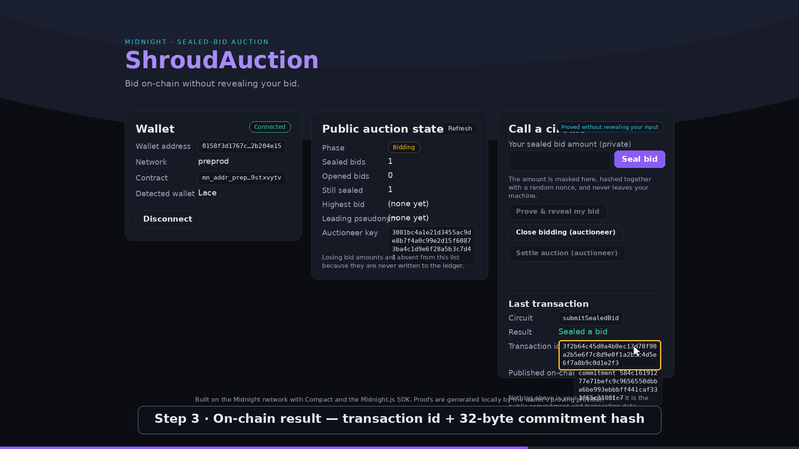

# ShroudAuction

[](https://github.com/Richardkingz2019/ShroudAuction/actions/workflows/ci.yml)

> A sealed-bid auction on Midnight where losing bids are never revealed — not even to the auctioneer.

## Live Demo

**<https://frontend-liart-nine-0xq4nwn1c5.vercel.app>**

[](https://github.com/Richardkingz2019/ShroudAuction/releases/tag/demo-v1)

*▶ Watch the demo: [demo-video.mp4](https://github.com/Richardkingz2019/ShroudAuction/releases/download/demo-v1/demo-video.mp4) — connect Lace, seal a bid, generate the proof locally, and watch the 32-byte commitment land on-chain.*

Deployed on Vercel and built with Node 22. The dApp is fully static from the same origin: the compiled contract module is bundled, and the proving keys and zkir are served from `/contracts/auction/{keys,zkir}` as `application/octet-stream`. It targets Midnight **Preprod** and connects to the Preprod contract address below.

> Requires the [Lace wallet](https://www.lace.io/) browser extension, configured for the Midnight Preprod network.

## Contract Address

| Network  | Address                                                                      |
|----------|------------------------------------------------------------------------------|
| Preprod  | mn_addr_preprod1yms6jevlk8pvsgv9r4aphjdr283qf3v6yg8lt50vl3yzunn2zh9stxvytv   |
| Preview  | d3c3fc548fc3304c7ff9ab5019e3e35e051e3a26c71fc1dcc45968e89c3934d6             |

## What This Does

ShroudAuction implements a sealed-bid (blind) auction in which bid amounts remain private while bidding is open, and losing bid amounts are never revealed on-chain:

1. **Seal.** A bidder chooses an amount, a 32-byte cryptographic random nonce, and a pseudonym. The values are hashed locally into a 32-byte commitment. Only the commitment is sent to the blockchain; the amount and nonce remain strictly on the bidder's device.
2. **Close.** The auctioneer closes bidding. No further commitments are accepted.
3. **Reveal.** Each bidder opens their commitment by proving, in zero knowledge, that their private witnesses (amount, nonce, alias) match the published commitment. The contract compares the opened amount against the current highest bid in-circuit.
4. **Settle.** Once all sealed bids have been opened, the auctioneer settles the auction and the leading bidder wins.

**Zero-Knowledge Privacy:** A bid that does not win is verified and then discarded inside the zero-knowledge proof — the losing amount is never written to the public ledger. An on-chain observer learns who bid (by pseudonym), that they bid, and which bid won — but never what any losing bidder offered.

## Privacy Model

- **PUBLIC:**
  - `phase`: The auction stage (`Bidding`, `Revealing`, `Settled`).
  - `auctioneer`: The public key that initialized the auction.
  - `bidCount`: Counter of total accepted sealed bids.
  - `sealedBids`: Pseudonym alias $\to$ 32-byte commitment hash (amount is completely hidden).
  - `revealedCount`: Number of bids opened during the reveal phase.
  - `highestBid`: The current winning amount (only recorded when a bid takes the lead).
  - `highestBidder`: Pseudonym of the winning bidder.

- **PRIVATE:**
  - `bidAmount()`: The true bid value (`Uint<64>`), known only to the bidder.
  - `bidNonce()`: 32 random blinding bytes preventing brute-force inversion of the commitment hash.
  - `bidderAlias()`: Pseudonym unlinked from wallet addresses, binding one bid per pseudonym.

- **PROVED without revealing:**
  - That the published 32-byte commitment is the valid hash of a secret bid amount, pseudonym, and blinding nonce known to the bidder.
  - That the opened bid is compared in-circuit against the running high bid; losing amounts are discarded without leaking onto the ledger.
  - That each pseudonym only submits a single bid.

## Privacy Claim

**What an on-chain observer sees vs cannot see:**

- **What an on-chain observer sees:**
  - The bidder's pseudonym alias (`Bytes<32>`).
  - The 32-byte commitment hash during the bidding phase.
  - Changes to public counters (`bidCount`, `revealedCount`).
  - The winning bid amount and winning pseudonym upon reveal.

- **What an on-chain observer CANNOT see:**
  - The losing bid amounts — verified in-circuit and never written to ledger state, logs, or events.
  - The secret blinding nonces.
  - The link between a bidder's wallet address and their pseudonym alias.
  - Any bid amounts while bidding is active.

## Tech Stack

- **Midnight Network:** Preprod testnet (target) and Preview testnet
- **Compact:** Smart contract language (language version 0.23, compiler toolchain 0.31.1)
- **Node.js:** v22.x LTS (enforced via `package.json` engines)
- **Frontend:** React 19, TypeScript, Vite 7
- **Wallet & Proving:** Lace Wallet with Midnight DApp Connector API v4, `@midnight-ntwrk/midnight-js-dapp-connector-proof-provider`
- **SDKs:** Midnight.js SDK 4.1.1 (`contracts`, `fetch-zk-config-provider`, `indexer-public-data-provider`, `level-private-state-provider`)
- **Testing:** Vitest 4/5 unit test runner with offline Compact runtime simulator
- **Deployment:** Vercel static hosting with WASM MIME configuration

## Prerequisites

- **Node.js v22+** (`node --version` prints `v22.x`)
- **npm v10+**
- **Lace Wallet** browser extension installed and switched to the **Midnight Preprod** network
- Funded Preprod wallet (via Nethermind Preprod Faucet: <https://midnight-tmnight-preprod.nethermind.dev>)

## Setup & Run Locally

1. **Clone the repository:**
   ```bash
   git clone https://github.com/Richardkingz2019/ShroudAuction.git
   cd ShroudAuction
   ```

2. **Install dependencies:**
   ```bash
   npm install --legacy-peer-deps
   ```

3. **Compile Compact smart contract (optional if using committed artifacts):**
   ```bash
   npm run compile
   ```

4. **Start the development server:**
   ```bash
   npm run dev
   ```
   Open `http://localhost:5173` in your browser.

5. **Build for production:**
   ```bash
   npm run build
   ```

## Run Tests

Run the full unit test suite covering circuit logic, state transitions, and zero-knowledge privacy assertions:

```bash
npm test
```

All 20 tests across `tests/counter.test.ts` and `tests/auction.test.ts` execute offline against the compiled Compact contract simulator.

## CI/CD

The automated continuous integration pipeline is defined in `.github/workflows/ci.yml`. It triggers on every `push` and `pull_request` to the `main` branch.

**Workflow Pipeline Steps:**
1. **Checkout code:** Pulls down the repository code via `actions/checkout@v4`.
2. **Install Node.js v22:** Sets up Node.js runtime version 22 via `actions/setup-node@v4`.
3. **npm install:** Installs root and project dependencies using `npm install --legacy-peer-deps`.
4. **compact compile:** Installs the Midnight Compact compiler CLI via the official release script and compiles smart contracts in `contracts/`, or validates existing precompiled ZK artifacts.
5. **Run test suite:** Executes `npm test` verifying circuit logic, state transitions, and zero-knowledge privacy guarantees.

## Product Proposal

See [PROPOSAL.md](PROPOSAL.md) for the product vision, Midnight differentiation, data model, and Mainnet feasibility.
